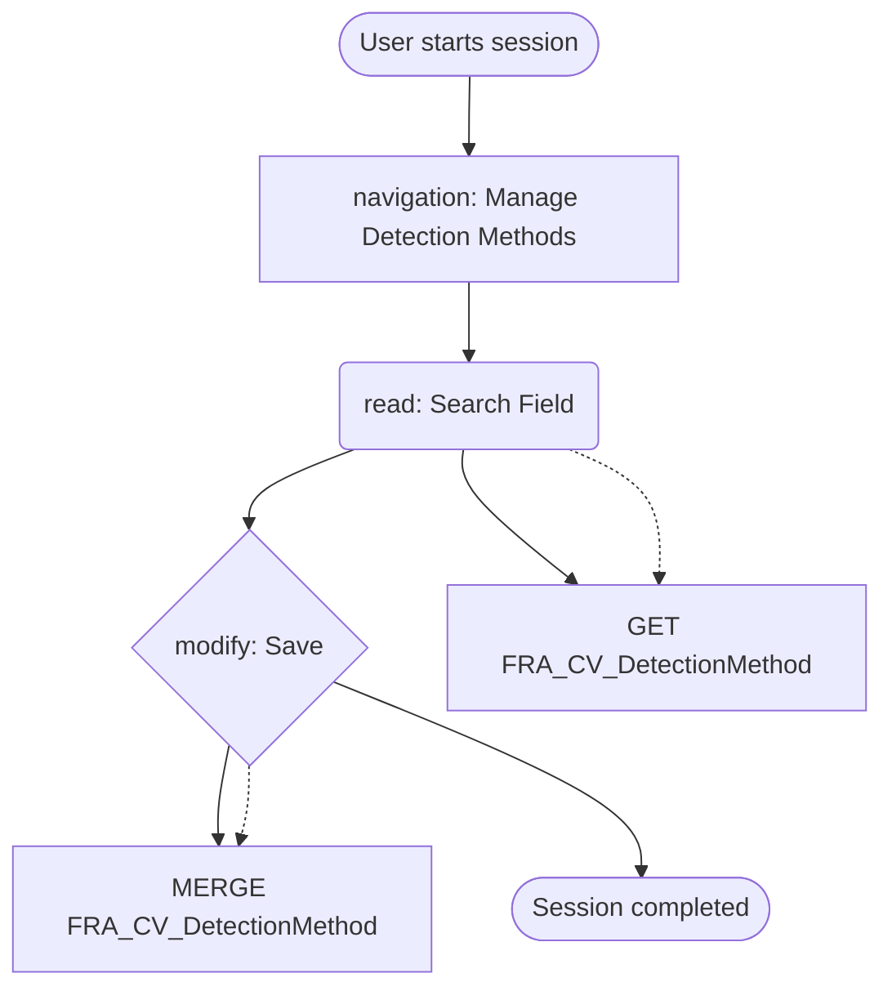

# Manage Detection Methods

## Session Overview

- **Session ID**: 6a886100-6ccf-4ce8-861d-79b8a83df22b
- **Application URL**: https://sapdev15.redmond.corp.microsoft.com:8422/sap/bc/ui2/flp#DetectionMethod-manage
- **Started**: 6/9/2025, 3:53:44 PM
- **Ended**: 6/9/2025, 3:54:09 PM
- **Duration**: 24 seconds
- **Total Events**: 20
- **Network Requests**: 10
- **User Agent**: Mozilla/5.0 (Windows NT 10.0; Win64; x64) AppleWebKit/537.36

## Business Process Flow



## OData Operations Summary

### 🔄 Modifying Operations

1. **MERGE FRA_CV_DetectionMethod**
```
{
  "DetectionMethodDescription": "City",
  "LastChangedDateTime": "/Date(1749479647000)/"
}
```

### ⚙️ Function Calls

(No function calls detected)

### 📖 Read Operations

- **FRA_IV_DetectionObjectType**: 2 read operations
- **FRA_IV_DetectionMethodType**: 1 read operation
- **FRA_IV_ContentType**: 1 read operation
- **FRA_CV_DM_ActionEnabledFlags**: 3 read operations
- **FRA_CV_DetectionMethod**: 5 read operations

## OData Analysis

### Entities Accessed

- **FRA_CV_DetectionMethod**: GET, MERGE
- **FRA_IV_DetectionObjectType**: GET
- **FRA_IV_DetectionMethodType**: GET
- **FRA_IV_ContentType**: GET
- **FRA_CV_DM_ActionEnabledFlags**: GET

### Operations Performed

- **UPDATE**: Entity update operation
- **READ**: Data retrieval operation

## Events Timeline

### 1. Click on span (+3s)


**Details:**
- **Type**: click
- **Time**: 3:53:48 PM
- **Element**: SPAN#__tile221-title-inner
- **Text**: "Manage Detection Methods"
- **Position**: (1063, 354)

---

### 2. Input: "ZSRC" (+8s)


**Details:**
- **Type**: input
- **Time**: 3:53:52 PM
- **Element**: INPUT#application-DetectionMethod-manageDetectionMethod-component---worklist--detectionMethodsFilterBar-filterItemControl_BASIC-Id-inner
- **Value**: "ZSRC"

**Correlated Network Requests:**

- **POST** $batch?sap-client=122
  - Confidence: 62%
  - Time difference: 2817ms

---

### 3. Click on span (+12s)


**Details:**
- **Type**: click
- **Time**: 3:53:57 PM
- **Element**: SPAN#__identifier3-__clone88-txt
- **Text**: "ZSCR_100_CITY"
- **Position**: (109, 338)

**Correlated Network Requests:**

- **POST** $batch?sap-client=122
  - Confidence: 100%
  - Time difference: 108ms

---

### 4. Click on bdi (+14s)


**Details:**
- **Type**: click
- **Time**: 3:53:58 PM
- **Element**: BDI#application-DetectionMethod-manageDetectionMethod-component---objectDmAmdp--ObjectPageLayout-OPHeaderContent-editHeaderBtn-BDI-content
- **Text**: "Edit Header"
- **Position**: (1614, 198)

---

### 5. Click on bdi (+18s)


**Details:**
- **Type**: click
- **Time**: 3:54:03 PM
- **Element**: BDI#application-DetectionMethod-manageDetectionMethod-component---objectDmAmdp--editHeaderSaveButton-BDI-content
- **Text**: "Save"
- **Position**: (992, 713)

**Correlated Network Requests:**

- **POST** $batch?sap-client=122
  - Confidence: 95%
  - Time difference: 3ms

---

### 6. Input: "City" (3 edits) (+20s)


**Details:**
- **Type**: input
- **Time**: 3:54:04 PM
- **Element**: INPUT#sap-ui-destroyed-application-DetectionMethod-manageDetectionMethod-component---objectDmAmdp--detectionMethodDescription-inner
- **Value**: "City"
- **Input Details**: 3 edits over 1s
- **Change**: "City" → "City"

---

## Session Summary

### Key Interactions

- **Actors**: User
- **Entities**: DetectionMethod
- **OData Operations**: 1

### OData Operations Details

1. **Event 0018**: MERGE on FRA_CV_DetectionMethod (95% confidence)