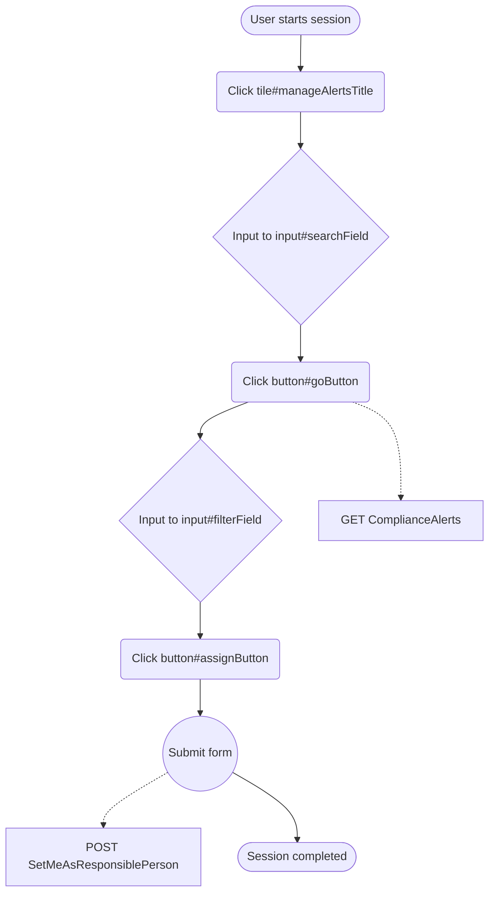
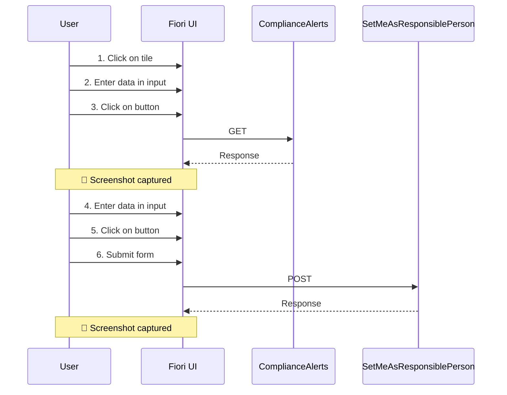

# Manage Alerts

## Session Overview

- **Session ID**: 12345678-abcd-1234-efgh-123456789012
- **Application URL**: https://example.sap.com/sap/bc/ui5_ui5/ui2/ushell/shells/abcd/FioriLaunchpad.html#ComplianceAlert-manage
- **Started**: 6/9/2025, 2:24:49 PM
- **Ended**: 6/9/2025, 2:28:15 PM
- **Duration**: 206 seconds
- **Total Events**: 8
- **Network Requests**: 15
- **User Agent**: Mozilla/5.0 (Windows NT 10.0; Win64; x64) AppleWebKit/537.36

## Process Flow



## Sequence Diagram



## OData Analysis

### Entities Accessed

- **ComplianceAlerts**: GET
- **SetMeAsResponsiblePerson**: POST

### Operations Performed

- **READ**: Data retrieval operation
- **UPDATE**: Entity update operation

## Events Timeline

### 1. Click on tile (+2s)


**Details:**
- **Type**: click
- **Time**: 2:24:51 PM
- **Element**: div#manageAlertsTitle
- **Text**: "Manage Alerts"
- **Position**: (320, 240)

---

### 2. Input: "high priority" (+8s)


**Details:**
- **Type**: input
- **Time**: 2:24:57 PM
- **Element**: input#searchField
- **Value**: "high priority"
- **Input Details**: 3 edits over 2s
- **Change**: "" → "high priority"

---

### 3. Click on button (+10s)


**Details:**
- **Type**: click
- **Time**: 2:24:59 PM
- **Element**: button#goButton
- **Text**: "Go"
- **Position**: (450, 260)

**Correlated Network Requests:**

- **GET** ComplianceAlerts
  - Confidence: 92%
  - Time difference: 150ms

---

### 4. Input: "Risk Management" (+15s)


**Details:**
- **Type**: input
- **Time**: 2:25:04 PM
- **Element**: input#filterField
- **Value**: "Risk Management"

---

### 5. Click on button (+18s)


**Details:**
- **Type**: click
- **Time**: 2:25:07 PM
- **Element**: button#assignButton
- **Text**: "Assign to Me"
- **Position**: (380, 350)

---

### 6. Form submission (+20s)


**Details:**
- **Type**: submit
- **Time**: 2:25:09 PM
- **Element**: form#assignmentForm

**Correlated Network Requests:**

- **POST** SetMeAsResponsiblePerson
  - Confidence: 95%
  - Time difference: 85ms

---

## Network Requests

### Request 1: GET odata-metadata

- **URL**: https://example.sap.com/sap/opu/odata/SAP/COMPLIANCE_ALERT_SRV/$metadata
- **Method**: GET
- **Type**: odata-metadata
- **Status**: 200
- **Duration**: 245ms

### Request 2: GET odata

- **URL**: https://example.sap.com/sap/opu/odata/SAP/COMPLIANCE_ALERT_SRV/ComplianceAlerts
- **Method**: GET
- **Type**: odata
- **Status**: 200
- **Duration**: 180ms

### Request 3: POST odata

- **URL**: https://example.sap.com/sap/opu/odata/SAP/COMPLIANCE_ALERT_SRV/SetMeAsResponsiblePerson
- **Method**: POST
- **Type**: odata
- **Status**: 200
- **Duration**: 120ms

**Request Body:**
```
{
  "AlertId": "12345",
  "ResponsiblePersonId": "USER001"
}
```

## Session Summary

### Key Interactions

- **Actors**: User
- **Entities**: ComplianceAlerts, SetMeAsResponsiblePerson
- **OData Operations**: 2

### OData Operations Details

1. **Event 0003**: GET on ComplianceAlerts (92% confidence)
2. **Event 0006**: POST on SetMeAsResponsiblePerson (95% confidence)