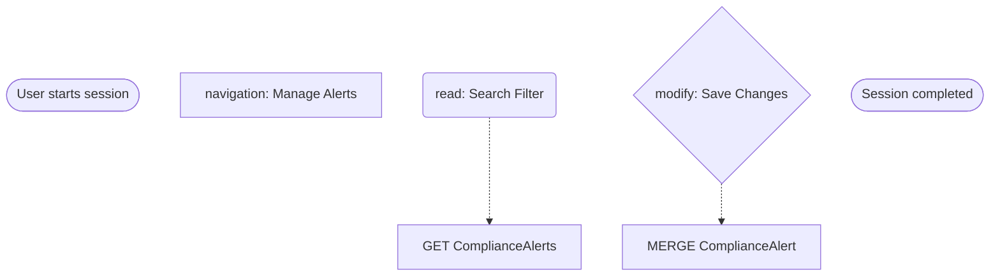

# Fiori Test Automation System - Browser Extension

🎯 **Intelligent test automation system for SAP Fiori applications with AI-powered analysis and OData correlation**

## ✅ Current Status: All Critical Issues Resolved

This extension is **fully functional** with all major issues fixed:
- ✅ Service worker installation errors resolved
- ✅ Event capture working properly  
- ✅ Screenshot system with rate limiting implemented
- ✅ Markdown export with mermaid diagrams
- ✅ Clean filename format implemented
- ✅ SAPUI5 detection enhanced
- ✅ Request filtering for cleaner captures

## Features

### Core Capabilities
- **Universal Capture**: Records all user interactions (clicks, inputs, form submissions, drag & drop, file uploads)
- **OData Correlation**: Automatically links UI actions with backend OData requests with confidence scoring
- **SAPUI5 Context**: Deep extraction of Fiori app context and control metadata using 6 detection methods
- **Screenshot Capture**: High-quality screenshots with semantic naming and rate limiting
- **Real-time Analysis**: Live feedback during recording sessions with input coalescing
- **Session Management**: Save, export, and replay recorded sessions

### Advanced Features
- **Network Request Interception**: Captures all HTTP requests with intelligent filtering
- **Business Process Flow**: Clean mermaid diagrams showing meaningful operations
- **Visual Documentation**: Screenshots embedded in markdown exports
- **Request Filtering**: Smart filtering of JS/CSS/assets to focus on business operations
- **Semantic Filenames**: Clean, sortable filenames (`fs-YYYY-MM-DD-HHMM-session-name-EEEE-type.png`)
- **Enterprise Ready**: Built for SAP environments with security best practices

### Export Formats

#### **JSON Export** (`fs-YYYY-MM-DD-HHMM-session-name.json`)
- Complete session data with sequence summaries
- Screenshot references with semantic IDs
- OData analysis and entity correlation
- Source of truth for all session data

#### **Markdown Export** (`fs-YYYY-MM-DD-HHMM-session-name.md`)
- Business process flow diagrams (mermaid)
- Embedded screenshots with proper filenames
- OData operations summary (modifying → functions → reads)
- Clean event timeline with meaningful events only

#### **Screenshot Export** (`fs-YYYY-MM-DD-HHMM-session-name-EEEE-type.png`)
- Individual PNG files with sequential IDs (0001, 0002, etc.)
- Semantic naming for easy sorting and correlation
- Rate-limited capture (2 per second max) to avoid browser restrictions

## Installation

### Quick Install
1. **Download/Clone** this repository
2. **Open Extensions**: Go to `chrome://extensions/` (or `edge://extensions/`)
3. **Enable Developer Mode**: Toggle the developer mode switch
4. **Load Extension**: Click "Load unpacked" and select this directory
5. **Verify**: Extension icon should appear in toolbar without errors

### Verify Installation
- Extension loads without service worker errors
- No red error messages in `chrome://extensions/`
- Extension icon appears in browser toolbar
- Can open popup without JavaScript errors

## Quick Start

### Basic Recording
1. **Navigate** to your Fiori application
2. **Click Extension Icon** to open popup
3. **Configure Session**:
   - Enter session name (optional)
   - ✅ Capture screenshots
   - ✅ Extract SAPUI5 context  
   - ✅ Auto-correlate OData
   - ✅ Filter JS/CSS/assets (recommended)
4. **Click "Start Recording"** (red button)
5. **Perform Actions** in the Fiori app
6. **Click "Stop"** when finished
7. **Export** using any format (JSON/Markdown/Screenshots)

### Expected Results
- Events captured in real-time (see counter in popup)
- Screenshots taken for key interactions
- Network requests correlated with user actions
- Clean session export with business process visualization

## File Output Examples

```
Session Export Results:
📄 fs-2025-06-09-1424-manage-alerts.json     # Complete session data
📄 fs-2025-06-09-1424-manage-alerts.md       # Visual documentation  
🖼️ fs-2025-06-09-1424-manage-alerts-0001-click.png
🖼️ fs-2025-06-09-1424-manage-alerts-0002-input.png
🖼️ fs-2025-06-09-1424-manage-alerts-0003-submit.png
```

## Markdown Export Features

### Business Process Flow


### OData Operations Summary
- **🔄 Modifying Operations**: Shows entity, keys, and payload
- **⚙️ Function Calls**: Lists function invocations with parameters  
- **📖 Read Operations**: Grouped by entity with counts

## Technical Architecture

### Extension Components
- **`background.js`**: Service worker handling network interception and session management
- **`content.js`**: Page context script for DOM event capture and UI5 detection
- **`popup.js`**: Extension popup UI and user interaction
- **`injected.js`**: Deep page context access for enhanced UI5 inspection
- **`ui5-detector.js`**: Advanced SAPUI5 application detection

### Key Features
- **Event Coalescing**: Input events are intelligently merged to reduce noise
- **Rate Limiting**: Screenshot capture respects Chrome API limits (2/second)
- **Smart Filtering**: Configurable filtering of static assets vs business requests
- **Semantic Naming**: All files use consistent, sortable naming conventions
- **Error Recovery**: Robust error handling with graceful degradation

## Troubleshooting

### Common Issues

#### "Extension won't install"
- **Cause**: Service worker syntax errors
- **Solution**: All syntax errors have been fixed in current version

#### "No events captured"
- **Cause**: Content script not synchronized with recording state
- **Solution**: Fixed in current version with proper state coordination

#### "Screenshot quota exceeded"
- **Cause**: Too many rapid screenshot requests
- **Solution**: Rate limiting implemented (550ms between captures)

#### "Markdown export fails"
- **Cause**: Type errors in request body processing
- **Solution**: Enhanced type checking implemented

### Debug Tools

1. **Extension Console**: Right-click extension icon → "Inspect popup"
2. **Background Console**: Go to `chrome://extensions/` → "Service worker" link
3. **Page Console**: F12 on Fiori page to see content script logs
4. **Test Script**: Run `/test_event_capture.js` in browser console for diagnostics

### Debug Commands
```javascript
// In browser console on Fiori page:
window.fioriTestCaptureInstance?.isRecording  // Check recording state
window.testRealClick()                       // Test event capture
```

## Development

### Build Requirements
- No build process required
- Pure JavaScript Chrome Extension (Manifest V3)
- Compatible with Chrome 88+, Edge 88+

### File Structure
```
fiori_automator/
├── manifest.json           # Extension manifest
├── background.js           # Service worker
├── content.js             # Content script
├── popup.html/js/css      # Extension popup
├── injected.js            # Page context script
├── ui5-detector.js        # UI5 detection
└── README.md              # This file
```

### Contributing
1. **Test thoroughly** with various Fiori applications
2. **Follow naming conventions** for consistency
3. **Update documentation** for any new features
4. **Verify cross-browser compatibility**

## Advanced Usage

### Session Analysis
- **Business Process Documentation**: Use markdown exports for process documentation
- **Performance Analysis**: Review network request timing and correlation
- **Test Automation**: JSON exports can be used to generate automated tests
- **Compliance Auditing**: Track user actions and system responses

### Enterprise Integration
- **CI/CD Integration**: Automated session capture in testing pipelines
- **Documentation Generation**: Business process documentation from user sessions
- **Training Materials**: Screenshot-rich documentation for user training
- **Regression Testing**: Recorded sessions as test specifications

## Support

### Resources
- **Testing Guide**: See `TESTING_GUIDE.md` for comprehensive testing instructions
- **Technical Details**: See `UI5_DETECTION_IMPROVEMENTS.md` for deep technical information
- **Examples**: See `EXAMPLE_CLEAN_MARKDOWN.md` for sample output

### Getting Help
1. **Check Console Logs**: Most issues show helpful error messages
2. **Run Diagnostics**: Use the provided test scripts
3. **Review Examples**: Compare your output with provided examples
4. **Check Recent Fixes**: All major issues have been resolved in current version

---

**Version**: 2.0.0 (All Critical Issues Resolved)  
**Last Updated**: June 2025  
**Compatibility**: Chrome 88+, Edge 88+, Manifest V3