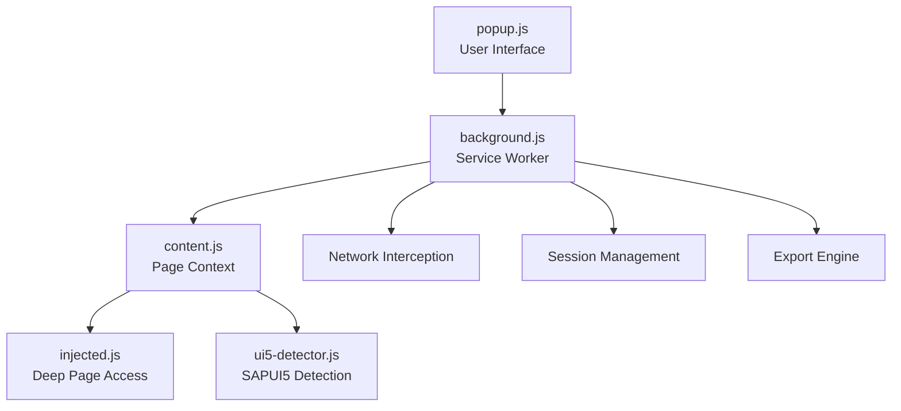

# Fiori Automator - Technical Implementation Guide

## 🏗️ Architecture Overview

The Fiori Test Automation Extension is built as a Chrome Manifest V3 extension with a clean separation of concerns across multiple components.

### Core Components



### Component Details

#### **background.js** (Service Worker)
- **Purpose**: Central coordination hub and data processor
- **Responsibilities**:
  - Network request interception via `chrome.webRequest` API
  - Session data management and storage
  - Screenshot capture with rate limiting
  - Export generation (JSON, Markdown, PNG)
  - OData analysis and correlation
  - Event processing and coalescing

#### **content.js** (Content Script)
- **Purpose**: DOM event capture and UI5 context extraction
- **Responsibilities**:
  - DOM event listeners (click, input, submit, keyboard)
  - Element context extraction (selectors, properties)
  - SAPUI5 control identification
  - Communication bridge to background script
  - Event queueing for offline scenarios

#### **popup.js** (Extension UI)
- **Purpose**: User interface and recording controls
- **Responsibilities**:
  - Recording session management (start/stop/pause)
  - Configuration options (screenshots, filtering, etc.)
  - Real-time status display
  - Export trigger functionality
  - Application detection display

#### **injected.js** (Page Context Script)
- **Purpose**: Deep page access for enhanced detection
- **Responsibilities**:
  - Direct access to `window.sap` object
  - UI5 component tree analysis
  - Model and binding inspection
  - Framework version detection

#### **ui5-detector.js** (Detection Engine)
- **Purpose**: Advanced SAPUI5 application detection
- **Responsibilities**:
  - 6-method detection strategy
  - Confidence scoring
  - App context extraction
  - Framework analysis

---

## 🔧 Key Technical Features

### 1. Event Capture & Processing

#### **Smart Event Filtering**
```javascript
isNoiseEvent(event) {
  // Filter out technical noise
  return event.type === 'editing_start' || 
         event.type === 'editing_end' ||
         (event.type === 'input' && (!event.value || event.value.trim() === ''));
}
```

#### **Input Event Coalescing**
- **Purpose**: Reduce noise from rapid typing
- **Algorithm**: Progressive string similarity detection
- **Time Window**: 1.5 seconds
- **Result**: Multiple keystrokes merged into single meaningful input event

#### **Business Operation Detection**
```javascript
isBusinessOperationStart(event) {
  const text = event.element?.textContent?.trim().toLowerCase() || '';
  return text.includes('save') || text.includes('assign') || 
         text.includes('go') || text.includes('search');
}
```

### 2. Network Request Intelligence

#### **Request Classification**
- **OData Detection**: Pattern matching for SAP OData services
- **Static Asset Filtering**: Intelligent filtering of JS/CSS/images
- **Business Request Focus**: Prioritize API calls and data modifications

#### **Correlation Algorithm**
```javascript
correlateNetworkRequests(event, session) {
  const correlationWindow = 10000; // 10 seconds
  // Enhanced confidence calculation considering causation patterns
  let confidence = Math.max(0, 100 - (absTimeDiff / correlationWindow * 40));
  
  // Boost confidence for likely causation patterns
  if (this.isLikelyCausationPattern(event, requestData, timeDiff)) {
    confidence = Math.min(95, confidence + 25);
  }
}
```

### 3. Screenshot System

#### **Rate Limiting Implementation**
```javascript
async processScreenshotQueue() {
  // Chrome allows 2 captures per second, wait 550ms between captures
  const timeSinceLastCapture = now - this.lastScreenshotTime;
  if (timeSinceLastCapture < 550) {
    await new Promise(resolve => setTimeout(resolve, 550 - timeSinceLastCapture));
  }
}
```

#### **Semantic Naming**
```javascript
generateScreenshotId(eventType, eventId, session, elementInfo) {
  // Format: fs-YYYY-MM-DD-HHMM-session-name-EEEE-event-type
  return `fs-${timestamp}-${sessionNameShort}-${formattedEventId}-${cleanEventType}`;
}
```

### 4. SAPUI5 Detection Strategy

#### **6-Method Detection Approach**
1. **Direct Namespace Detection**: `window.sap.ui` existence
2. **Core Access**: `sap.ui.getCore()` functionality  
3. **Bootstrap Detection**: UI5 bootstrap script presence
4. **Resource Detection**: UI5 resource loading patterns
5. **DOM Indicators**: Fiori-specific CSS classes and structures
6. **URL Pattern Analysis**: Fiori launchpad URL structures

#### **Confidence Scoring**
```javascript
detectUI5App() {
  let confidence = 0;
  if (window.sap?.ui) confidence += 0.4;
  if (this.hasUI5Bootstrap()) confidence += 0.3;
  if (this.hasUI5DOMIndicators()) confidence += 0.2;
  // ... additional checks
  return { isUI5App: confidence > 0.5, confidence };
}
```

---

## 📊 Data Flow & Storage

### Session Data Structure
```javascript
const session = {
  sessionId: 'uuid-v4',
  tabId: number,
  startTime: timestamp,
  endTime: timestamp,
  duration: milliseconds,
  metadata: {
    sessionName: string,
    applicationUrl: string,
    userAgent: string,
    filterJSRequests: boolean,
    appSemantics: object
  },
  events: [
    {
      eventId: '0001',
      timestamp: number,
      type: 'click|input|submit|keyboard',
      element: elementInfo,
      ui5Context: ui5Context,
      coordinates: {x, y},
      value: string,
      screenshot: screenshotReference,
      correlatedRequests: []
    }
  ],
  networkRequests: [
    {
      requestId: 'uuid',
      method: 'GET|POST|MERGE',
      url: string,
      type: 'odata|odata-batch|sap-get',
      timestamp: number,
      requestBody: object|string,
      responseHeaders: array,
      statusCode: number,
      duration: milliseconds
    }
  ]
};
```

### Export Data Structure
```javascript
const exportData = {
  formatVersion: '1.0',
  exportedAt: isoString,
  session: cleanedSessionData,
  summary: {
    sequenceSummary: {
      actors: ['User'],
      entities: ['ComplianceAlert', 'DetectionMethod'],
      interactions: [],
      odataOperations: []
    },
    odataAnalysis: {
      entities: [],
      operations: []
    }
  }
};
```

---

## 🎨 Markdown Generation

### Business Process Flow Generation
```javascript
generateCleanFlowDiagram(businessFlow) {
  // Groups events into meaningful business operations
  // Different shapes for different operation types:
  // - modify: {} (rhombus)
  // - function: (()) (circle)  
  // - read: () (rounded rectangle)
  // - navigation: [] (rectangle)
}
```

### OData Operations Summary
```markdown
### 🔄 Modifying Operations
1. **MERGE FRA_CV_DetectionMethod**
```
{
  "DetectionMethodDescription": "City",
  "LastChangedDateTime": "/Date(1749479647000)/"
}
```

### ⚙️ Function Calls
1. **Function: SetMeAsResponsiblePerson**

### 📖 Read Operations  
- **FRA_CV_DetectionMethod**: 5 read operations
- **FRA_IV_DetectionObjectType**: 2 read operations
```

---

## 🛠️ Error Handling & Recovery

### Service Worker Error Recovery
```javascript
async handleMessage(message, sender, sendResponse) {
  try {
    // Main processing logic
  } catch (error) {
    this.logError('Background message handling error:', error);
    sendResponse({ success: false, error: error.message });
  }
}
```

### Content Script Communication Resilience
```javascript
async sendEventToBackground(eventData) {
  try {
    await chrome.runtime.sendMessage({type: 'capture-event', data: eventData});
  } catch (error) {
    // Store locally as fallback
    this.eventQueue.push({timestamp: Date.now(), eventData, error: error.message});
  }
}
```

### Screenshot Queue Management
```javascript
async captureTabScreenshot(tabId, elementInfo, eventType, eventId) {
  // Queue the screenshot request to handle rate limiting
  return new Promise((resolve, reject) => {
    this.screenshotQueue.push({tabId, elementInfo, eventType, eventId, resolve, reject});
    if (!this.processingScreenshots) {
      this.processScreenshotQueue();
    }
  });
}
```

---

## 🚀 Performance Optimizations

### Memory Management
- **Session Cleanup**: Automatic cleanup after saving
- **Screenshot Limits**: Keep only last 100 screenshots per tab
- **Request Filtering**: Reduce memory footprint by filtering irrelevant requests
- **Event Coalescing**: Merge redundant input events

### Async Processing
- **Non-blocking Operations**: All heavy processing uses async/await
- **Queue Management**: Screenshot and export operations are queued
- **Background Processing**: Network analysis happens in service worker
- **Lazy Loading**: UI5 detection only when needed

### Storage Optimization
```javascript
cleanSessionData(session) {
  // Remove circular references and limit data size
  return {
    // ... essential session data only
    events: session.events?.map(event => this.cleanEventData(event)) || [],
    networkRequests: session.networkRequests?.map(req => this.cleanNetworkData(req)) || []
  };
}
```

---

## 🔒 Security Considerations

### Content Security Policy Compliance
- **Manifest V3**: Full compliance with latest Chrome extension standards
- **No eval()**: Pure function-based JavaScript
- **Sandboxed Scripts**: Injected scripts run in isolated contexts

### Data Privacy
- **Local Storage**: All data stored locally in browser
- **No External APIs**: No data sent to external servers
- **User Control**: User controls all export and sharing

### Permission Model
```json
{
  "permissions": [
    "activeTab",
    "webRequest", 
    "storage",
    "scripting"
  ],
  "host_permissions": ["<all_urls>"]
}
```

---

## 🔄 Future Enhancement Points

### Enhanced UI5 Integration
- **Component Tree Analysis**: Deep component hierarchy inspection
- **Model Binding Analysis**: Data binding and model inspection
- **Route Analysis**: Navigation and routing patterns

### Advanced Analytics
- **Performance Metrics**: Response time analysis
- **User Behavior Patterns**: Interaction pattern analysis
- **Business Process Mining**: Automated process discovery

### Test Generation
- **Automated Test Scripts**: Generate test code from sessions
- **Cross-browser Testing**: Multi-browser session replay
- **CI/CD Integration**: Automated testing pipeline integration

---

**Architecture Version**: 2.0.0  
**Last Updated**: June 2025  
**Chrome API**: Manifest V3 Compatible